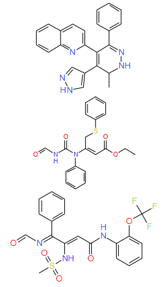

# Molecule-RNN
Molecule-RNN is a recurrent neural network built with Pytorch to generate molecules for drug discovery. 

## Tokenization of SMILES
There are different ways to tokenize SMILES, 3 of them are implemented in this project:
1. Character-level tokenization, which is a naive way to tokenize SMILES. In this scheme, every character is treated as a single token expect those two-charater elements such Al and Br. 
2. Regular expression-based tokenization. In this scheme, each pair of square bracket [*] is also treated as a single token.
3. SELFIES tokenization. SELFIES stands for Self-Referencing Embedded Strings, it is a 100% robust molecular string representation. See details [here](https://github.com/aspuru-guzik-group/selfies).

## Dataset
The chembl28 dataset is used. It is under ```./dataset```

## Training
1. Set the ```out_dir``` in ```train.yaml``` as the directory where you want to store output results.
2. Set ```which_vocab``` and ```vocab_path``` in ```train.yaml``` to specify which tokenization scheme to use. The pre-computed vocabularies are at ```./vocab```.
3. Twick other hyper-paramters in ```train.yaml``` if you like (the default setting is working).  
4. Run the training script.
```
python train.py
```

## Sampling
The trained model will be saved in the ```out_dir``` directory. We can generate molecules by sampling the trained model according to the output distribution. If the ```-result_dir``` is not specified, the ```out_dir``` in ```train.yaml``` will be used.
```
python sample.py -result_dir your_output_dir
```

The default setting yields over 80% valid rate for character-level tokenization and regex-based tokenization, and it gives 99.9% valid rate for SELFIES tokenization. After the sampling, we can filter out the invalid SMILES:
```
python filter_sampled.py -result_dir your_output_dir
```

Here are examples of some sampled molecules:

<p align="center">
    
</p>   

## TODOs
Currently beam search sampling is not supported given the lenghts of the sequences. Feel free to make a PR or write an issue if you have any idea to search for molecules with high probabilities. :)   
